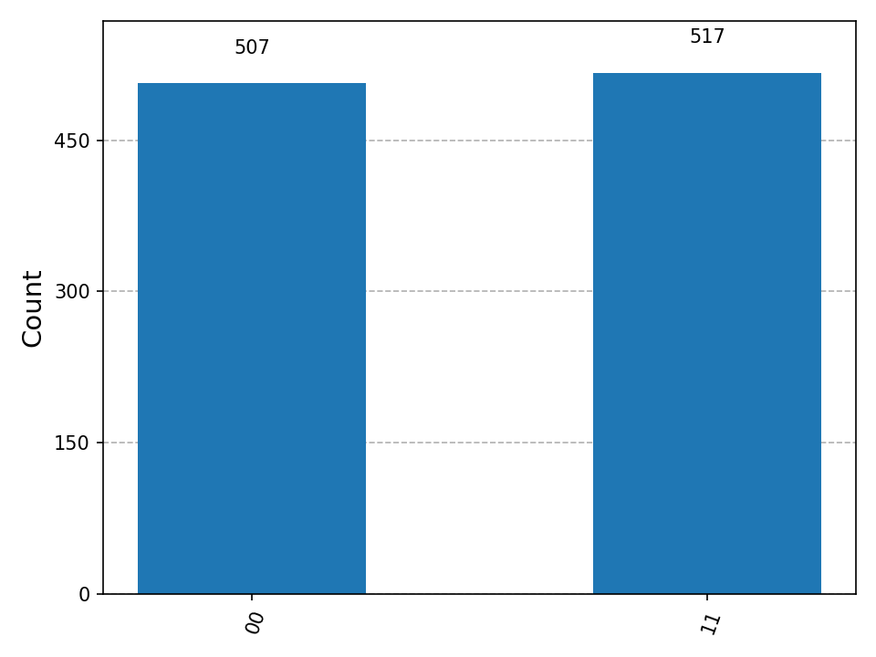
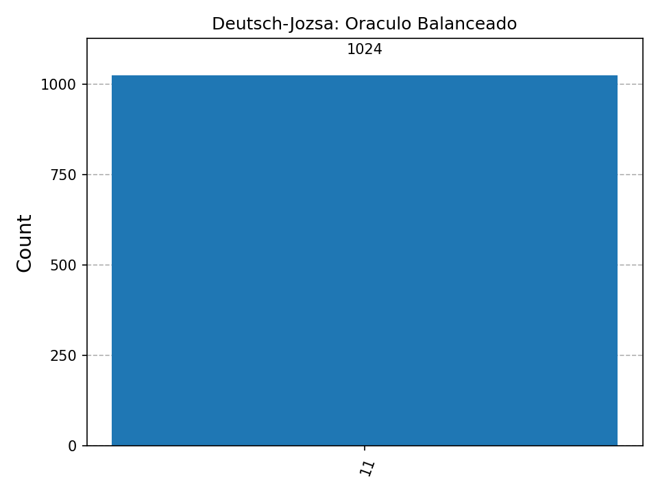
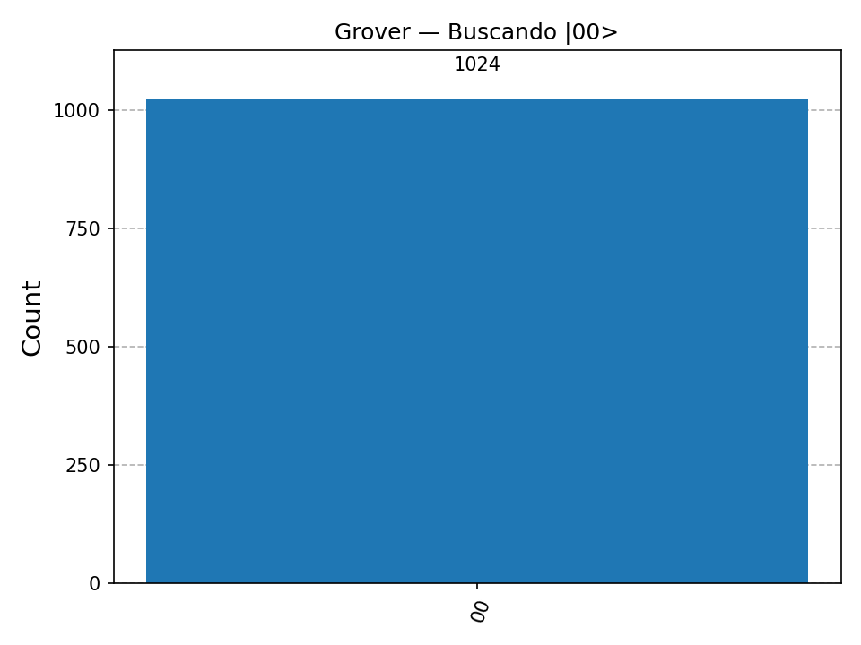

# Carvajal-post1-u12

**Arquitectura de Computadores — Unidad 12: Computación Emergente y Tendencias**  
Duvan Carvajal | Ingeniería de Sistemas | UFPS | 2026

---

## Objetivo

Implementar y simular tres circuitos cuánticos fundamentales usando Qiskit:
1. **Estado de Bell** — entrelazamiento cuántico
2. **Algoritmo de Deutsch-Jozsa** — primera ventaja cuántica demostrada
3. **Algoritmo de Grover** — búsqueda cuántica con aceleración cuadrática

Todos los experimentos usan el simulador `AerSimulator` (no se requiere hardware cuántico real ni cuenta en IBM Quantum).

---

## Prerrequisitos

```bash
python --version                                        # Python 3.9+
pip install qiskit qiskit-aer matplotlib
python -c "import qiskit; print(qiskit.__version__)"   # Verificar instalación
```

---

## Estructura del repositorio

```
Carvajal-post1-u12/
├── README.md
├── src/
│   ├── bell_state.py       # Experimento 1: Estado de Bell
│   ├── deutsch_jozsa.py    # Experimento 2: Algoritmo Deutsch-Jozsa
│   └── grover.py           # Experimento 3: Algoritmo de Grover
└── capturas/
    ├── bell_histogram.png
    ├── dj_constante.png
    ├── dj_balanceado.png
    ├── grover_00.png
    ├── grover_01.png
    ├── grover_10.png
    └── grover_11.png
```

---

## Cómo ejecutar

```bash
# Desde la raíz del repositorio
python src/bell_state.py
python src/deutsch_jozsa.py
python src/grover.py
```

---

## Experimento 1: Estado de Bell |Φ⁺⟩

### Circuito

```
q0: ─ H ──●── M
           │
q1: ──────X── M
```

- **Puerta Hadamard (H)** en q0: lleva |0⟩ a superposición (|0⟩ + |1⟩)/√2
- **Puerta CNOT** (control=q0, target=q1): entrelaza los dos qubits

### Resultado esperado

| Estado | Probabilidad |
|--------|-------------|
| \|00⟩  | ~50%        |
| \|11⟩  | ~50%        |
| \|01⟩  | 0% (nunca)  |
| \|10⟩  | 0% (nunca)  |

**Interpretación:** El entrelazamiento cuántico garantiza correlación perfecta: al medir q0 se determina instantáneamente el estado de q1. Los estados |01⟩ y |10⟩ nunca aparecen porque los qubits siempre colapsan juntos al mismo valor. Esto es imposible de replicar con bits clásicos.



---

## Experimento 2: Algoritmo de Deutsch-Jozsa

### ¿Qué determina?

Dada una función f: {0,1}ⁿ → {0,1}, el algoritmo determina con **1 sola evaluación del oráculo** si la función es:
- **Constante**: f(x) = 0 para toda entrada, o f(x) = 1 para toda entrada
- **Balanceada**: f(x) = 0 para exactamente la mitad de entradas, y f(x) = 1 para la otra mitad

### Ventaja cuántica

| Caso       | Clásico (peor caso, n=2) | Cuántico |
|------------|--------------------------|----------|
| Constante  | hasta 3 evaluaciones     | **1**    |
| Balanceada | hasta 3 evaluaciones     | **1**    |

### ¿Por qué basta 1 evaluación?

El algoritmo coloca todos los qubits de entrada en superposición uniforme y el qubit ancilla en |−⟩ = (|0⟩ − |1⟩)/√2. Al aplicar el oráculo, la función se evalúa sobre **todas las entradas simultáneamente** gracias al paralelismo cuántico (truco del kick-back de fase). Las puertas Hadamard finales crean interferencia:

- **Función constante:** las amplitudes de todos los estados distintos de |00⟩ se cancelan por interferencia destructiva → la medición siempre da `00`.
- **Función balanceada:** la amplitud de |00⟩ se cancela por interferencia destructiva → la medición **nunca** da `00`.

Clásicamente, en el peor caso hay que evaluar 2ⁿ⁻¹ + 1 = **3 entradas** para n=2 para estar seguros del resultado.

### Resultados

| Oráculo    | Resultado medición | Interpretación   |
|------------|--------------------|------------------|
| Constante  | `{"00": 1024}`     | f(x) = constante |
| Balanceada | sin `"00"`         | f(x) = balanceada |




---

## Experimento 3: Algoritmo de Grover (n=2 qubits)

### ¿Qué hace?

Busca el elemento marcado en una base de datos no estructurada de N=2ⁿ elementos con aceleración cuadrática: necesita O(√N) evaluaciones en lugar de O(N) del caso clásico.

### ¿Por qué 1 iteración es suficiente para n=2?

El número óptimo de iteraciones de Grover es:

> iteraciones = ⌊ (π/4) · √N ⌋

Para n=2 qubits, N=4:

> iteraciones = ⌊ (π/4) · √4 ⌋ = ⌊ (π/4) · 2 ⌋ = ⌊ 1.5707 ⌋ = **1**

Con 1 iteración, la probabilidad del estado marcado sube de 25% (distribución uniforme inicial) a **100% teórico**, lo que en la práctica se observa como >90% en el simulador.

### Pasos del circuito

1. **Superposición uniforme:** Hadamard en todos los qubits → cada estado tiene probabilidad 1/4
2. **Oráculo de fase:** invierte la fase del estado target (multiplica su amplitud por -1)
3. **Difusor:** inversión alrededor de la media → amplifica la amplitud del estado marcado

### Resultados

| Target buscado | Estado más probable | Probabilidad |
|----------------|---------------------|-------------|
| \|00⟩          | \|00⟩               | ~100%       |
| \|01⟩          | \|01⟩               | ~100%       |
| \|10⟩          | \|10⟩               | ~100%       |
| \|11⟩          | \|11⟩               | ~100%       |




---

*Duvan Carvajal — UFPS 2026*
